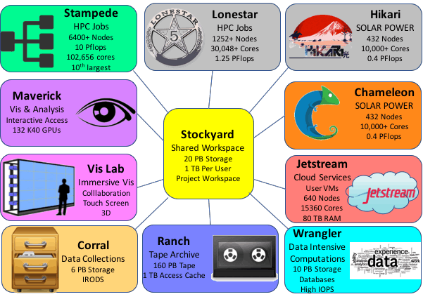

What are the disk/file system resources on TACC HPC systems?
============================================================

.. image:: ./images/HPC_Storage.png
   :target: ./images/HPC_Storage.png
   :alt: Schematic Diagram of TACC HPC Cluster

A typical HPC system at TACC uses:
^^^^^^^^^^^^^^^^^^^^^^^^^^^^^^^^^^

**/home1**

* LustreFS
* 13 TB LS5, 524 TB Stampede
* each user has 5 GB quota
* ENV VAR: ``$HOME``

**/scratch**

* LustreFS
* 7.5 PB
* Unlimited quota, but 10 day limit
* ENV VAR: ``$SCRATCH``

**/work**

* LustreFS
* 20 PB
* each user has 1 TB quota
* ENV VAR: ``$WORK``

**/corral-repl**

* GPFS/NFS
* 6x2 PB
* 6 PB in each of Austin and Arlington
* typical quota: 5 TB but varies based on need
* folder path provided upon allocation (ex. ``/corral-repl/TACC/bio/ECR``)

**RANCH TAPE Robot**

* LTFS
* 160 PB
* Unlimited quota
* ENV VAR: ``$ARCHIVER``, ``$ARCHIVE``

Stockyard
^^^^^^^^^

* The ``$WORK`` filesystem on Stockyard helps knit TACC HPC Systems together
* Files on ``$WORK`` are present on most systems.

