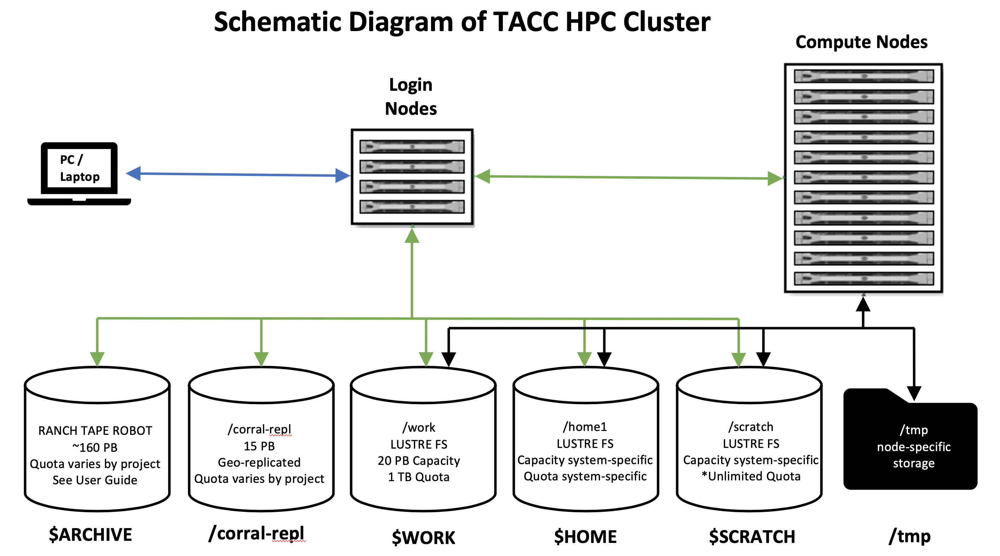

What are the disk/file system resources on TACC HPC systems?
============================================================

**A typical HPC cluster schematic at TACC is outlined above.**

For example, Stampede2 uses:
^^^^^^^^^^^^^^^^^^^^^^^^^^^^

**/home1**

* LustreFS
* ~1 PB overall capacity
* each user has 10 GB quota
* ENV VAR: ``$HOME``

**/scratch**

* LustreFS
* ~30 PB overall capacity
* Unlimited quota, but 10 day limit
* ENV VAR: ``$SCRATCH``

**/work**

* LustreFS
* 20 PB global share work file system
* each user has 1 TB quota
* ENV VAR: ``$WORK``

**/tmp**

Each compute node has a local ``/tmp`` directory. ``/tmp`` can be used to read/write files that do not need to be accessed by other tasks. Data stored in ``/tmp`` is temporary, and lasts only for the duration of your job.

* Stampede2 SKX: 144 GB storage per compute node
* Stampede2 KNL: 107 GB storage per compute node for ``normal``/``large``, 32 GB storage per compute node for ``development``

TACC HPC Storage Systems
^^^^^^^^^^^^^^^^^^^^^^^^

**/corral-repl**

* GPFS/NFS
* 6x2 PB
* 6 PB in each of Austin and Arlington
* typical quota: 5 TB but varies based on need
* folder path provided upon allocation (ex. ``/corral-repl/TACC/bio/ECR``)

**RANCH TAPE Robot**

* ~160 PB backing tape store
* quota varies based on need, though users are typically limited to 2 TB
* ENV VAR: ``$ARCHIVER``, ``$ARCHIVE``

Stockyard
^^^^^^^^^

**Global File System**

* The ``$WORK`` filesystem on Stockyard helps knit TACC HPC Systems together
* Files on ``$WORK`` are present on most systems
* 20 PB of storage capacity
* 100+ gigabytes per second of aggregate bandwidth

